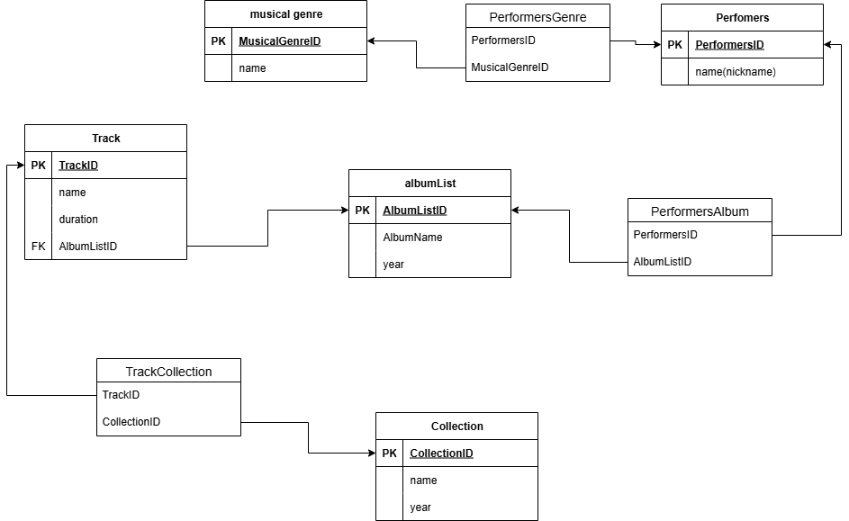

    
CREATE TABLE musical genre(  
MusicalGenreID SERIAL PRIMARY KEY,  
    name VARCHAR(100) NOT NULL,  
);
    
CREATE TABLE Performers(  
PerformersID SERIAL PRIMARY KEY,  
    name(nickname) VARCHAR(100) NOT NULL,  
);
     
CREATE TABLE PerformersGenre(  
    PerformersID INTEGER REFERENCES Performers(PerformersID),  
    MusicalGenreID INTEGER REFERENCES musical genre(MusicalGenreID),  
);
    
CREATE TABLE albumList(  
    AlbumListID SERIAL PRIMARY KEY,  
    AlbumName VARCHAR(100) NOT NULL,  
    year VARCHAR(4) NOT NULL,  
);
    
CREATE TABLE PerformersAlbum(  
    PerformersID INTEGER REFERENCES Performers(PerformersID),  
    AlbumListID INTEGER REFERENCES albumList(AlbumListID),  
);

CREATE TABLE Track(  
    TrackID SERIAL PRIMARY KEY,  
    name VARCHAR(100) NOT NULL,  
    duration VARCHAR(10) NOT NULL,  
    AlbumListID INTEGER REFERENCES albumList(AlbumListID),  
);

CREATE TABLE Collection(  
    CollectionID SERIAL PRIMARY KEY,  
    name VARCHAR(100) NOT NULL,  
    year VARCHAR(4) NOT NULL,  
);

CREATE TABLE TrackCollection(  
    TrackID INTEGER REFERENCES Track(TrackID),  
    CollectionID INTEGER REFERENCES Collection(CollectionID),  
);